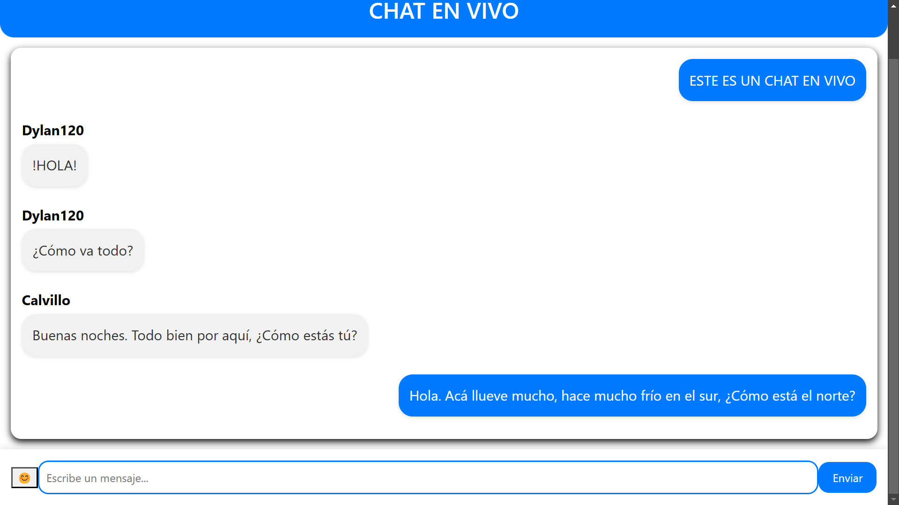
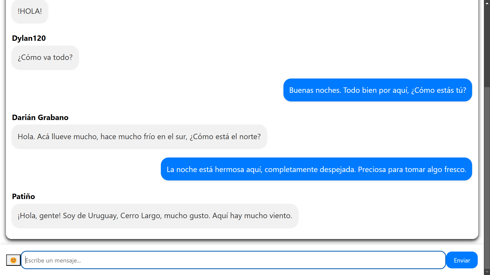
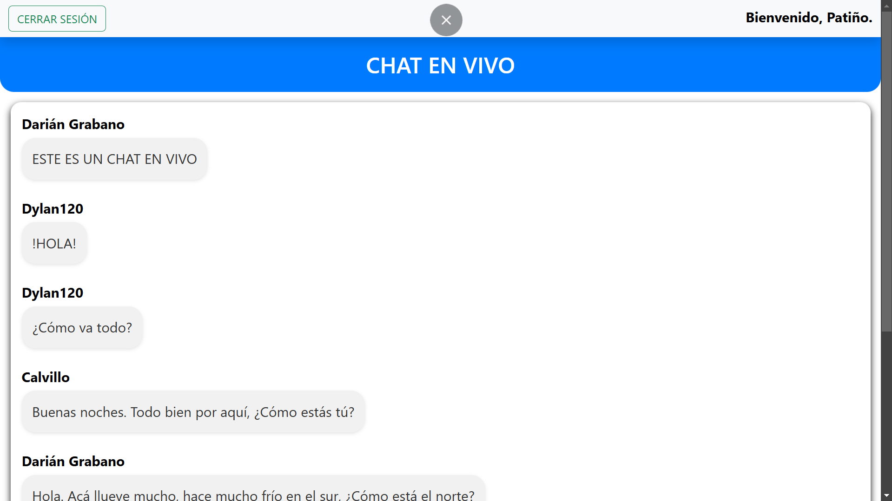

# CHAT EN VIVO

Este proyecto es una aplicación de chat en vivo, diseñada para ofrecer una experiencia funcional y sencilla. Fue desarrollado con el objetivo de aprender y demostrar cómo implementar un sistema de mensajería en tiempo real.

## Características principales

- **Tecnologías utilizadas:**
  - **HTML**: Estructura de la aplicación.
  - **CSS**: Estilos básicos para la interfaz.
  - **JavaScript**: Lógica y funcionalidad del chat.
  - **Firebase**: Backend para la autenticación y almacenamiento de datos.

- **Registro e inicio de sesión:**
  - Los usuarios deben registrarse para acceder al chat.
  - Los formularios de registro verifican que no se repitan nombres o DNIs.
  - Solo los usuarios registrados pueden acceder al chat.

- **Chat en vivo:**
  - Barra de texto para escribir y enviar mensajes.
  - Posibilidad de enviar emojis, tanto predefinidos como personalizados.

- **Diseño funcional:**
  - Mezcla de colores relajantes y agradables.
  - Enfoque en la funcionalidad y usabilidad sobre el diseño visual.

- **Responsividad:**
  - Compatible con dispositivos móviles.

## Estructura del proyecto

El proyecto consta de las siguientes funcionalidades principales:

1. **Registro:** Permite a los usuarios crear una cuenta.
2. **Inicio de sesión:** Verifica las credenciales para acceder al chat.
3. **Chat en vivo:** Espacio principal donde los usuarios pueden enviar y recibir mensajes en tiempo real.

## Vista previa

A continuación, se presentan algunas capturas de pantalla del proyecto:

  
  
  

## Enlace al proyecto

Puedes visitar la versión en vivo del proyecto en el siguiente enlace:
[GitHub Pages](https://tuusuario.github.io/nombre-del-repositorio)

## Notas adicionales

- Este proyecto fue desarrollado como una demostración de habilidades y aprendizaje.
- Aunque la información ingresada puede ser ficticia, se recomienda evitar datos sensibles.
- El enfoque principal fue entender y aplicar la funcionalidad de un chat en vivo, por lo que el diseño visual es sencillo.

## Autor

Encargado del desarrollo: **Darián Grabano**.
 
Ide/s utilizado/s: Visual Studio Code.
 
Redes sociales:
- Instagram: https://www.instagram.com/nahuelgra22
- Correo: dariangrabano22@gmail.com
- Facebook: https://www.facebook.com/darian.grabano

Este proyecto fue creado con entusiasmo para aprender y compartir. Si tienes alguna pregunta o sugerencia, no dudes en contactarme a través de GitHub.

---

¡Gracias por visitar este proyecto! Espero que lo encuentres interesante y útil.

